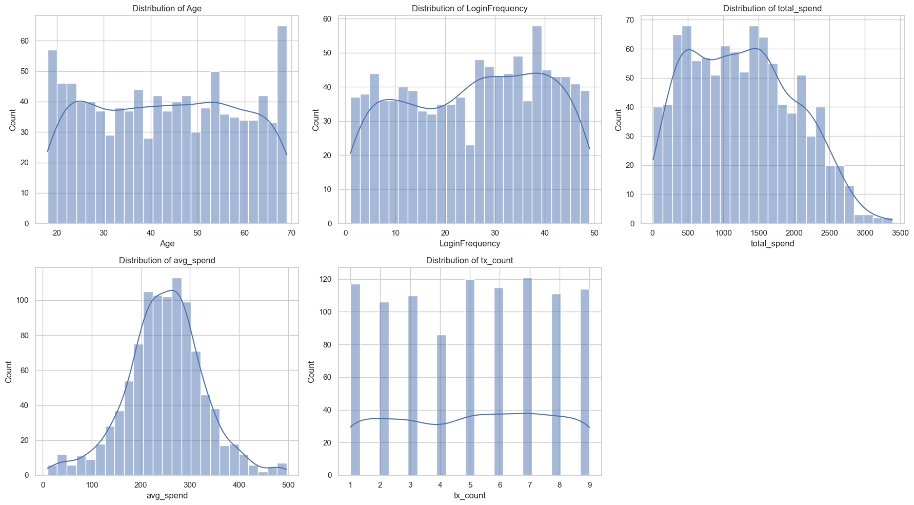
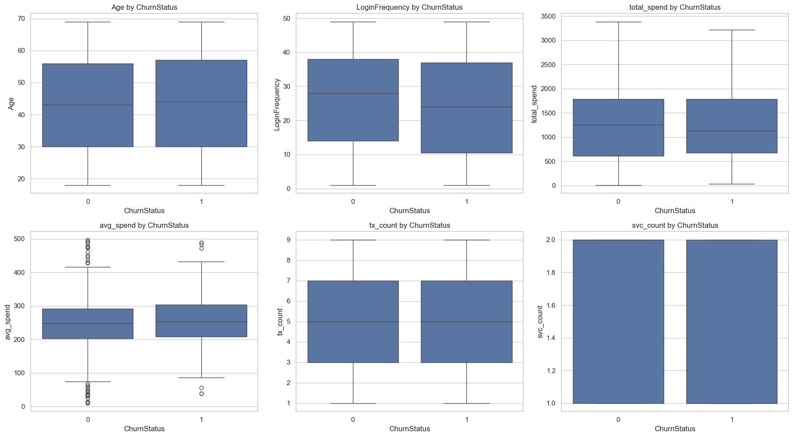
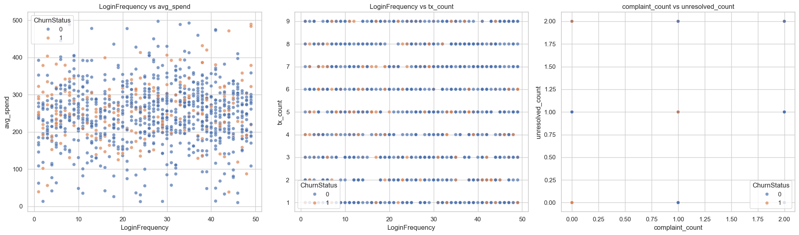

# Lloyd Banking Churn Prediction


**Problem:** Retail banks lose high-value customers without enough early-warning signals; this project predicts customer churn risk using customer behavior, service, and engagement data.

## Table of Contents 📑

- [Header](#lloyd-banking-churn-prediction)
- [About the Project 📚](#about-the-project-)
- [Screenshots / Demo 📷](#screenshots--demo-)
- [Technologies Used ☕️ 🐍 ⚛️](#technologies-used-️--)
- [Setup / Installation 💻](#setup--installation-)
- [Approach 🚶](#approach-)
- [Example Usage / Output](#example-usage--output)
- [Project Structure 📁](#project-structure-)
- [Status 📶](#status-)
- [Limitations ⚠️](#limitations-️)
- [Improvements / Roadmap 🚀](#improvements--roadmap-)
- [Credits 📝](#credits-)
- [Author](#author)

## About the Project 📚

This repository builds a practical churn prediction workflow for a banking context using real tabular customer data from demographics, transactions, support interactions, and digital usage.

It was built to answer a product problem: **which customers are likely to leave soon, and what signals should retention teams act on first?**

It is for data scientists, ML engineers, and analytics teams who want a reproducible baseline they can extend into production scoring pipelines.

## Screenshots / Demo 📷





**Backend-style sample output (risk scoring):**

```text
customer_id=483, churn_probability=0.72, risk_tier=HIGH
customer_id=117, churn_probability=0.51, risk_tier=MEDIUM
customer_id=902, churn_probability=0.18, risk_tier=LOW
```

## Technologies Used ☕️ 🐍 ⚛️

| Layer | Tools |
|---|---|
| Language | Python |
| Data Processing | pandas, numpy, openpyxl |
| Visualization | matplotlib, seaborn |
| ML | scikit-learn |
| Experiment Runtime | Jupyter Notebook |
| Dataset | Excel workbook (`Customer_Churn_Data_Large.xlsx`) |

## Setup / Installation 💻

```bash
git clone https://github.com/raghuveer9303/LLoyd-Banking-Churn-Project.git
cd LLoyd-Banking-Churn-Project
python -m venv .venv
source .venv/bin/activate  # Windows: .venv\Scripts\activate
pip install -r requirements.txt
jupyter notebook
```

Open and run:
1. `lloyd_task1.ipynb` (data prep + EDA)
2. `lloyd_task2.ipynb` (modeling + evaluation)

## Approach 🚶

- **Pipeline style:** Two-stage ML workflow
  - Stage 1: build customer-level analytical dataset from multi-sheet raw data
  - Stage 2: train, compare, and tune churn classifiers
- **Design choices:**
  - Aggregate event-level transaction/service logs to customer grain
  - Preserve missingness as signal using `<feature>_was_missing` flags
  - Handle class imbalance using stratified validation and class-aware metrics
- **Model strategy:** Benchmark Logistic Regression, Decision Tree, Gradient Boosting, and Random Forest, then tune the selected model with GridSearchCV.

## Example Usage / Output

### Example 1

```text
input:
Customer profile: Age=46, IncomeLevel=Low, ServiceUsage=Mobile App
Behavior: LoginFrequency=3/week, avg_spend=4200, unresolved_rate=0.40

output:
churn_probability=0.74 -> HIGH_RISK
recommended_action="priority retention call + issue resolution follow-up"
```

### Example 2

```text
input:
Customer profile: Age=31, IncomeLevel=High, ServiceUsage=Website
Behavior: LoginFrequency=19/week, avg_spend=9800, unresolved_rate=0.00

output:
churn_probability=0.11 -> LOW_RISK
recommended_action="standard engagement campaign"
```

### Example 3

```text
input:
Batch scoring request: 1,000 active customers

output:
Top 10% high-risk segment identified (100 customers)
Campaign list exported with ranked churn probabilities
```

## Project Structure 📁

```text
LLoyd-Banking-Churn-Project/
├── README.md                         # Project overview, setup, architecture, and usage
├── requirements.txt                  # Python dependencies for notebooks and ML workflow
├── Customer_Churn_Data_Large.xlsx    # Source multi-sheet dataset used for analysis/modeling
├── lloyd_task1.ipynb                 # Data gathering, cleaning, feature construction, and EDA
├── lloyd_task1_report.md             # Written summary of Task 1 analysis and preprocessing
├── lloyd_task2.ipynb                 # Model training, comparison, tuning, and evaluation
├── lloyd_task2_report.md             # Detailed report of model results and business interpretation
└── report_assets/
    ├── histograms_key_numerical_features.png  # Distribution analysis of core numeric features
    ├── boxplots_by_churn.png                  # Feature separation and outlier view by churn class
    └── scatter_relationships_churn.png        # Pairwise behavior patterns colored by churn
```

## Status 📶

**Maintained, in-progress.**

- **Stable:** Data preparation pipeline, EDA workflow, baseline model comparison, tuned Random Forest training.
- **Experimental:** Threshold optimization, calibration strategy, production deployment flow, and monitoring automation.

## Limitations ⚠️

- Dataset is small (1,000 customers), so metric variance is high on holdout splits.
- Current features are mostly snapshot-based; limited temporal trends reduce predictive signal.
- Class imbalance (~20% churn) still affects recall at default threshold settings.
- No production API or scheduled retraining pipeline yet.

## Improvements / Roadmap 🚀

1. Add time-aware features (recency, trend, rolling behavior deltas) and retrain.
2. Add probability calibration + threshold tuning tied to campaign budget constraints.
3. Introduce experiment tracking and model versioning (e.g., MLflow).
4. Package scoring as a lightweight API/batch job with automated weekly inference.
5. Add data-drift and model-performance monitoring dashboards.

## Credits 📝

- Dataset and assignment context inspired by Lloyds Banking Group churn analytics use case.
- Built with open-source ecosystem: [pandas](https://pandas.pydata.org/), [scikit-learn](https://scikit-learn.org/), [matplotlib](https://matplotlib.org/), [seaborn](https://seaborn.pydata.org/).
- Methodology references: scikit-learn model selection and ensemble learning documentation.

## Author

Raghuveer — [LinkedIn](https://www.linkedin.com/) | [GitHub](https://github.com/raghuveer9303)
